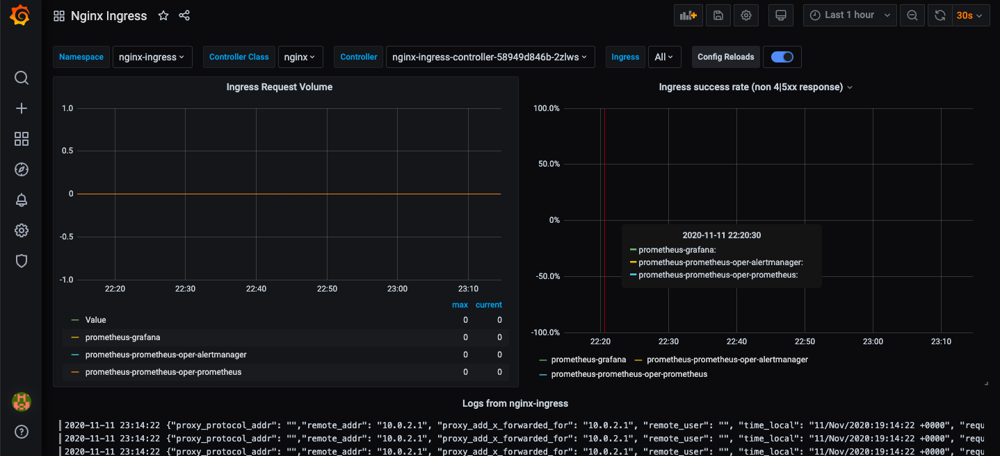
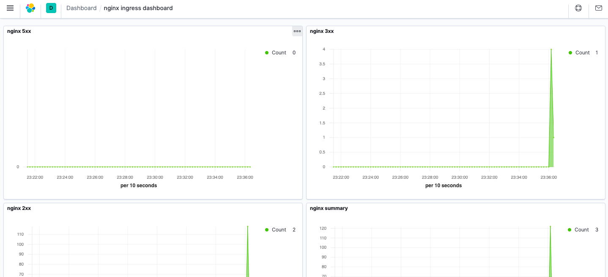
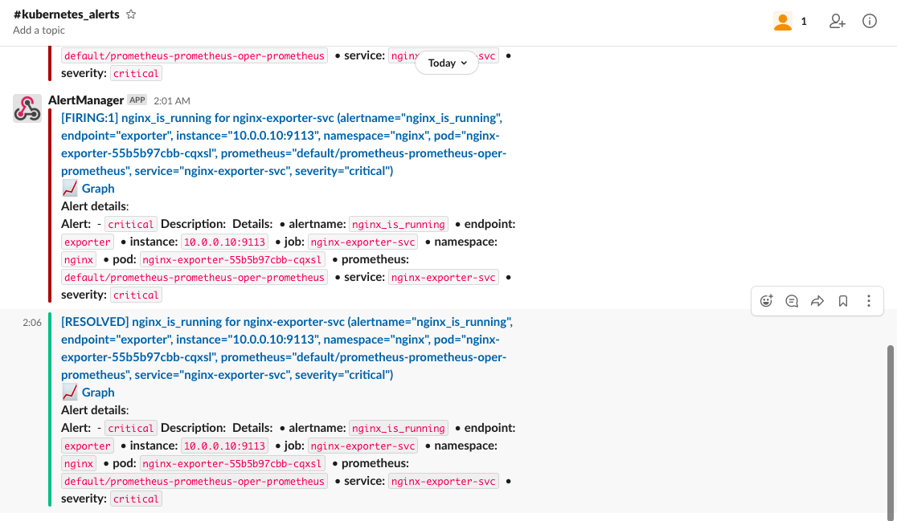

# Комментари по домашнему заданию
## Что делал.
0. Создал кластер с двумя пулами для инфрастурктурных сервисов и приложения. Использовал taints для инфраструктурных нод.
1. Установил elasticsearch, kibana, fluentbit.
2. Попробовал разобраться с дублирующими полями, одно переопределил, другое удалил. См. yaml для fluentbit.
3. Сконфигурировал cert-manager.
4. Установил ingress контроллер, cert-manager, prometheus-operator.
5. Настроил оповещения от prometheus-operator в slack.
6. Добавил index pattern в kibana.
7. Создал rules для alertmanager, убирал ноды с еластиком, получил оповещение в слак, что у нас проблема :)
8. Добился, чтобы логи nginx-ingress появились в кибане (tolerations для fluentbit).
9. Перевел логи nginx-ingress в json формат.
10. Настроил визуализации в кибане.
11. Установил в кластер loki и promtail (Daemonset).
12. Создал дашборд в графане для nginx-ingress с графиками и логами.
13. Старался всё описать в коде, поэтому все json дашборды в файле values для прометей оператора.
## Grafana

## Kibana

## Slack
