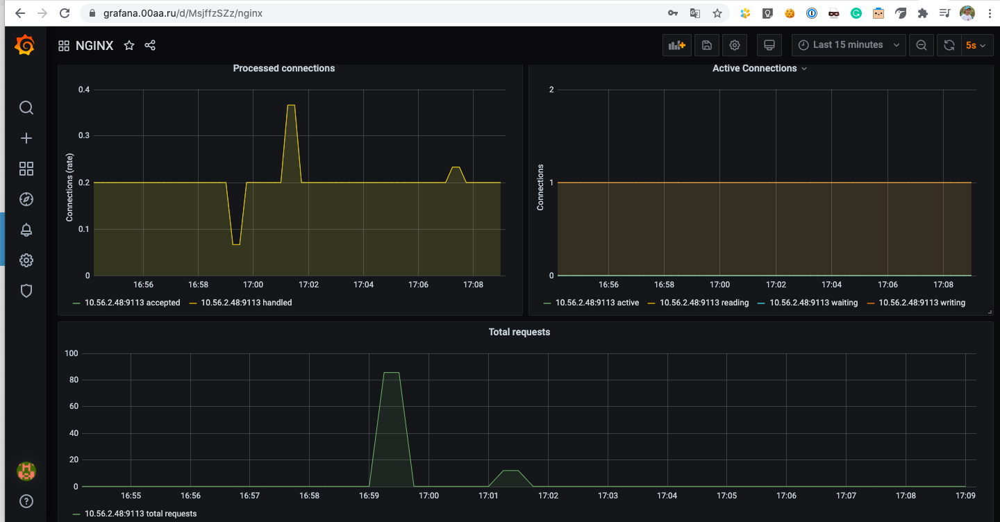
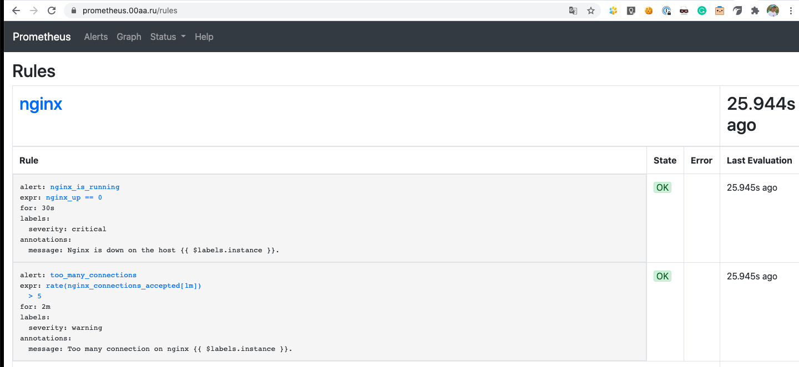

# Комментари по домашнему заданию
## Что делал.
0. Создал образ с nginx с необходимым функционалом и тэгом v2.
1. Создал deployment, namespace, service для app nginx.
2. Создал deployment, service для nginx exporter.
3. Установил prometheus operator с помощью helm3, предварительно поковыряв values.yaml из chart. Для всех сервисов (prometheus, grafana, alertmanager) натсроил ingress.
3. Создал ServiceMonitor для nginx exporter.
4. Добавил в values.yaml кастомные rules для prometheus и кастомный dashboard для grafana
## Как установить
0. ```cd kubernetes-monitoring && helm upgrade --install prometheus stable/prometheus-operator -f prometheus-operator/values.yaml```
1. ```kubectl apply -f .```
## Grafana

## Prometheus rules
